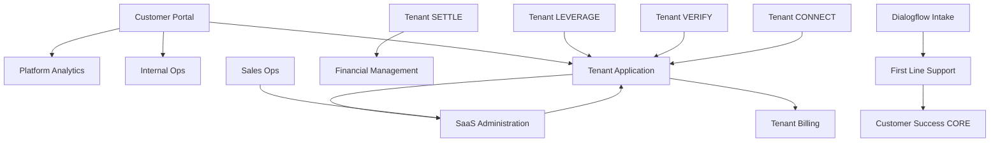

# Service Dependency Map

> High-level data flow and integration points between services.

## Key Integration Flows (verified as of 2026-08-01)

| Flow | Direction | Status | Detail |
|------|-----------|--------|--------|
| Sales Ops → SaaS Admin (application approval) | Sales Ops → SaaS Admin | ✅ LIVE | `POST /api/v1/webhooks/sales-ops/application-approved` — creates `core_contacts` row, calls back to Sales Ops with `contact_id`. Auth: X-API-Key (needs HMAC upgrade by 2026-09-01). |
| SaaS Admin → Sales Ops (contact callback) | SaaS Admin → Sales Ops | ✅ LIVE | `PATCH /api/v1/leads/{leadId}` — sets `saas_contact_id` and `pipeline_stage: 'converted'` on approval. |
| SaaS Admin → INTAKE (tenant provisioning) | SaaS Admin → INTAKE | ✅ LIVE | `POST {INTAKE_SERVICE_URL}/webhooks/saas-admin` — `tenant.created` event via `onboarding-orchestrator.ts:78-118`. HMAC-SHA256 signed. (Previously documented as STUB — now implemented.) |
| SaaS Admin → CS-Support (tenant created) | SaaS Admin → CS-Support | ✅ LIVE | `CSSupportWebhookClient.sendTenantCreated()` via `tenants/route.ts:210-227`. |
| Tenant App → SaaS Admin (intake lead CRM sync) | INTAKE → SaaS Admin | ✅ LIVE | `SaaSAdminCRMClient.sync_lead()` — called from `application-approved` webhook callback in SaaS Admin. (Previously documented as BUILT, NOT WIRED — now wired.) |
| Tenant App → SaaS Admin (subscription confirm) | INTAKE → SaaS Admin | ✅ LIVE | `subscription.updated` webhook confirmation. |
| Sales Ops → CS-Support (customer handoff) | Sales Ops → CS-Support | ✅ LIVE | `POST /api/v1/customer-handoffs` via `CSSupportServiceClient.createCustomerHandoff()`. Creates onboarding ticket. |
| Sales Ops → Tenant App (tenant provisioning) | Sales Ops → INTAKE | ⚠️ VIOLATION | `POST /api/v1/tenants/provision` via `TenantApplicationServiceClient.provisionTenant()`. App2 writing directly to App3. Must be removed — provisioning should go through SaaS Admin only. |

## Known Broken Links
- **Platform Analytics → Supabase DB** — DNS fails (see [[Incident-001]])
- **Internal Ops → Supabase REST** — port 443 unreachable (same root cause)
- **Sales Ops → INTAKE (tenant provisioning)** — App2→App3 trust-domain violation. `provisionTenant()` bypasses SaaS Admin. Must be removed.

## Data Flow Notes
- All services use Supabase as backing store (with direct or REST access)
- Registry pattern exists in Internal Ops but is nascent
- No event bus / message queue exists yet — services call each other via HTTP
- **Sales Ops must NOT call Tenant App directly.** The provisioning handoff must go Sales Ops → SaaS Admin → INTAKE. The current `provisionTenant()` call is a trust-domain violation.
- **Webhook auth migration:** Application-approved webhook uses simple X-API-Key. Must upgrade to HMAC-SHA256 (WebhookSignature v1.0) before 2026-09-01 legacy cutoff.
