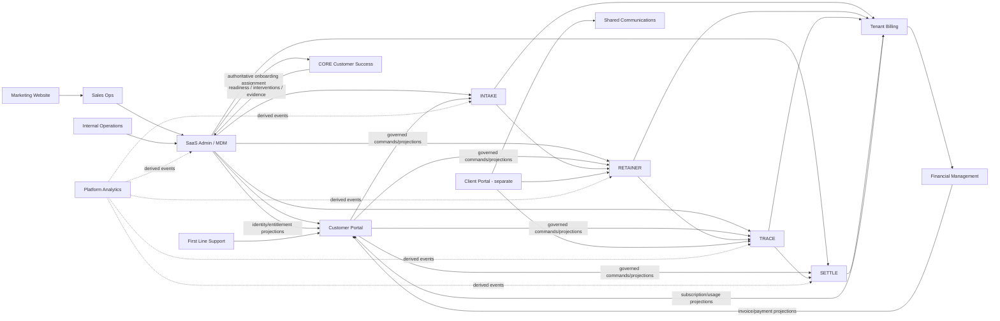

# TrueVow Developer Start Here

**Version:** 3.1  
**Updated:** 2026-08-10  
**Audience:** Developers, QA engineers, Platform Operations, technical product owners

## 1. Read this before opening a repository

TrueVow is a multi-repository platform for law-firm acquisition, onboarding, intake, engagement, matter production, settlement intelligence, commercial billing, and financial operations.

It is not one monolithic application. Each repository owns a bounded part of business reality. A repository may display another service's state or submit a command to another service, but it may not silently become the canonical writer for that state.

The first architecture rule is:

> A user interface may request a change, but only the canonical owning service may validate, decide, and persist the business change.

The second rule is:

> Code presence is not the same as active product scope. Retracted, partial, transitional, and future modules must remain visibly labelled.

## 2. The three portal architecture

TrueVow currently distinguishes three user-facing portals.

| Portal | Users | Scope | Authentication | Primary purpose |
|---|---|---|---|---|
| SaaS Admin | TrueVow internal staff | Cross-tenant | Internal SSO / platform IAM | Tenant identity, onboarding, commissioning, lifecycle and operational entitlements |
| Customer Portal | Law-firm attorneys and staff | One tenant | `@truevow/auth` backed by Supabase | Use INTAKE, RETAINER, TRACE, SETTLE, Billing, Team, Notifications, VERIFY and Settings |
| Client Portal | Prospects and signed clients | Own invitation/matter | Invitation token / OTP target | Engagement review, uploads, messages and client-facing matter actions |

The Client Portal is a separate repository target. It must not be implemented by exposing the law-firm Customer Portal to clients.

## 3. Two journeys must never be confused

### 3.1 Prospect-to-Revenue Golden Journey

The canonical platform journey is:

```text
Prospect discovery
→ normalization / canonical identity
→ enrichment
→ classification
→ governed campaign
→ real engagement
→ demo
→ application
→ human approval
→ Sales Ops T020/T022
→ durable HMAC handoff
→ SaaS Admin authoritative commissioning
→ onboarding run
→ CSM customer-success onboarding
→ Billing / INTAKE / Portal provisioning
→ controlled activation
→ product usage
→ revenue assurance
→ support
→ offboarding
```

This replaces earlier campaign-specific framing. The previous `PLATFORM-E2E-01` campaign proved the initial commissioning boundary through FM acknowledgment and is retained as historical commissioning evidence, not the current complete journey.

### 3.2 Complete law-firm product lifecycle

The complete product lifecycle is:

```text
Law firm prospect
→ application
→ approved tenant
→ Customer Portal access and onboarding
→ INTAKE activation
→ prospective-client intake
→ firm review
→ RETAINER conflict/engagement/activation
→ represented client and activated matter
→ TRACE matter production and demand readiness
→ attorney-authorized demand position
→ SETTLE analysis and negotiation support
→ client-authorized resolution
→ Billing commercial calculation
→ Financial Management invoicing, payment and accounting
```

Customer Portal spans this lifecycle as the law firm's experience layer. It does not own the canonical business decisions behind the screens.

## 4. System map



Arrows show governed integration or projection flow. They never grant direct database access.

## 5. Repository purposes

| Repository | Lifecycle role | Canonical authority |
|---|---|---|
| Marketing Website | Public acquisition | Public content and application UX only |
| Sales Ops | Application and approval | Customer application, human approval, approved handoff |
| SaaS Admin / MDM | Platform control plane | Tenant/contact identity, IAM, onboarding, lifecycle, operational entitlements |
| Customer Portal | Law-firm experience/BFF | UI preferences, saved filters and transient presentation state only |
| Client Portal | Prospect/client experience | Client-facing presentation and governed commands only |
| INTAKE | Intake runtime | Templates, tenant intake configuration, sessions, intake facts and usage events |
| RETAINER | Engagement and activation | Representation workflow, conflict review, packages, ceremonies and activation records |
| TRACE | Matter production | Source-linked facts, evidence, providers, chronology, liens, issues and readiness |
| SETTLE | Settlement intelligence | Analysis request, comparable set, confidence rationale, warnings and report versions |
| Tenant Billing | Commercial authority | Catalogue, subscriptions, trials, usage rating, allowances, overage and statements |
| Financial Management | Financial/accounting authority | Invoices, AR, payments, refunds, treasury, revenue and GL |
| CORE Customer Success | Customer-success orchestration | Onboarding communications/forms, scheduling, readiness evidence, engagement monitoring, interventions and escalation. CSM-local workflow only. ZERO tenant creation, activation, billing, cancellation, custom-intake approval or authoritative lifecycle mutation authority. |
| First Line Support | Support operations | Support case, triage, assignment and escalation |
| Shared Communications | Communication delivery | Message delivery, status and audit |
| Internal Operations | Operational control surface | Health, retry, replay and dead-letter operations only |
| Platform Analytics | Analytical projection | Derived metrics and journey analytics only |

### 5.1 Pending cross-service contract

> **WARNING — SaaS Admin → CSM canonical onboarding contract:**
> `PENDING: TV-PR-SAAS-CSM-ONTOLOGY-CONTRACT-01`
> 
> The legacy `POST /api/v1/customers/transfer` endpoint is **NOT CANONICAL**.
> Do not build new integrations against it.
> CSM receives authoritative onboarding assignment from SaaS Admin, not directly from Sales Ops.

## 6. Customer Portal verified current state

The Customer Portal architecture decision dated 2026-08-04 documents:

- Next.js 14.2 App Router and TypeScript 5.3.
- `@truevow/auth` backed by Supabase.
- `@truevow/rbac-engine`.
- Tenant resolution through `hooks/useTenant.ts`.
- Server-side `/api/*` proxy routes.
- 54 dashboard page files and 62 API route files.
- Active INTAKE, Calendar, TRACE, RETAINER, SETTLE, Billing, Notifications, Team, VERIFY and Settings surfaces.
- LEVERAGE and CONNECT code preserved but hidden/retracted.
- DRAFT partial/legacy.
- COMMAND not built.

Do not infer that every active screen has complete backend commissioning. UI presence, API proxy presence, deployed backend capability, and full E2E proof are separate statuses.

## 7. Current versus target architecture

Developers must read `TRUEVOW-CURRENT-VS-TARGET-ARCHITECTURE.md` before changing integrations.

Important current deviations include:

1. Customer Portal feature access currently comes from Billing.
2. Feature gating currently fails open if Billing is unavailable.
3. Approved target authority places operational entitlement in SaaS Admin.
4. TRACE currently uses a broad catch-all proxy while RETAINER uses strict route allowlists.
5. `NEXT_PUBLIC_DEV_TENANT_ID` is a development fallback and must never silently operate in production.
6. Billing currently requires Clerk keys on Fly as a runtime dependency, while the Customer Portal uses Supabase auth. This is a transitional implementation fact, not a reversal of the platform auth direction.

## 8. Non-negotiable rules

1. One canonical writer per aggregate.
2. No cross-service database writes.
3. Commands are intentions; events are facts. A command is not a fact merely because it was queued. A delivery is not successful merely because transport was suppressed. An event must represent an effect that actually occurred. Simulation is not commissioning evidence.
4. Projections are read-only and rebuildable.
5. Customer Portal never becomes a hidden source of truth.
6. Human-reserved decisions remain human-authorized.
7. Every machine action is tenant-scoped, versioned, auditable and replay-safe.
8. INTAKE owns executable workflow construction.
9. RETAINER owns engagement workflow records, not tenant lifecycle.
10. TRACE preserves provenance and contradictions.
11. SETTLE supports judgment; it does not guarantee outcomes or accept settlement.
12. Billing calculates commercial obligations; FM creates financial documents and moves money.
13. SaaS Admin owns operational entitlement and tenant lifecycle.
14. Missing entitlement data must not silently grant product access.
15. Tenant identity must come from the authenticated server-side context, not browser-supplied trust alone.
16. No external command may be recorded as successfully delivered unless its authoritative external effect actually occurred. A suppressed transport, disabled delivery mode, or simulated response is not delivery success.
17. Security credentials are purpose-bound. Do not reuse or fallback to another service's API key, webhook secret, or signing secret for an unrelated capability.
18. A service may recommend or request an authoritative action; calling the authoritative service's API does not transfer that authority to the caller.

## 9. How to read a repository

Read in this order:

```text
docs/REPO-START-HERE.md
→ UI/API entry point
→ application service
→ domain policy/state transition
→ repository/transaction
→ outbox/inbox or response
→ downstream projection/acknowledgment
→ contract and E2E tests
```

For UI repositories also trace:

```text
page/component
→ hook/query
→ Next.js API route/BFF
→ service client
→ backend contract
→ canonical owner
```

## 10. How to trace one law firm

Capture one `correlation_id` and the canonical IDs created at each boundary:

```text
lead_id
application_id
handoff_id
handoff_package_id
customer_id
contact_id
tenant_id
onboarding_run_id
platform_command_id
csm_contact_id
identity_profile_id
tenant_membership_id
application_grant_id
provisioning_command_id
configuration_version
intake_session_id
matter_candidate_id
retainer_candidate_id
conflict_search_id
engagement_package_id
ceremony_id
matter_id
trace_case_id
trace_readiness_id
settle_analysis_id
settle_report_id
usage_event_id
commercial_statement_id
fm_acknowledgment_id
invoice_id       # later FM phase
payment_id       # later FM phase
```

Never reconcile services by firm name or email alone.

## 11. Documentation reading order

1. `TRUEVOW-DEVELOPER-START-HERE.md`
2. `TRUEVOW-LAW-FIRM-CUSTOMER-LIFECYCLE-AND-REPO-MAP.md`
3. `TRUEVOW-CURRENT-VS-TARGET-ARCHITECTURE.md`
4. `TRUEVOW-ONTOLOGY-DEVELOPER-GUIDE-v3.md`
5. Local `REPO-START-HERE-*` guide
6. `TRUEVOW-CROSS-SERVICE-CONTRACT-CATALOG.md`
7. Relevant E2E runbook and UI checklist
8. Evidence index and defect register

When working on CSM Core, start at:
```text
TrueVow_Customer_Success_CORE_Service/
  docs/DEVELOPER_GUIDE.md
  docs/CSM_CORE_ARCHITECTURE.md
  CSM-ONTOLOGY-DELTA.md
```

## 12. Stop conditions

Stop and escalate when:

- Two services appear to own the same canonical fact.
- A portal shows success before the owner accepted the command.
- A service reads/writes another service's database.
- Missing Billing or entitlement data grants product access.
- A tenant ID can be overridden by browser input or development fallback in production.
- A replay creates a second canonical record.
- RETAINER bypasses attorney/authority classes.
- TRACE loses provenance or overwrites a contradiction.
- SETTLE hides weak evidence, warnings or confidence limitations.
- Billing sends invoice numbers/journal instructions to FM.
- FM recalculates commercial price, allowance or usage.
- CSM is asked to mint a `tenant_id`.
- CSM is asked to create, activate, or cancel a tenant.
- CSM confidence is being used to grant platform authority.
- A new Sales Ops → CSM commissioning path appears outside the SaaS Admin handoff.
- New code targets the legacy `POST /api/v1/customers/transfer` endpoint.
- A cross-service event or command is being invented outside the ontology registry.
- CSM is asked to mint a tenant_id, create/activate/cancel a tenant, or modify billing.
- CSM confidence is used to grant platform authority.
- A new Sales Ops → CSM commissioning path appears.
- New code targets the legacy `/customers/transfer` endpoint.
- A cross-service event or command is invented outside the ontology registry.
