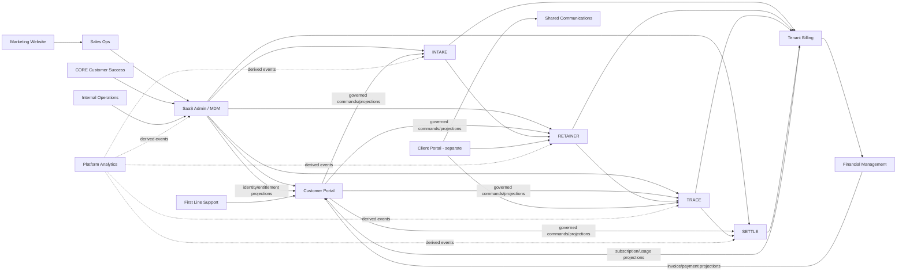

# TrueVow Developer Start Here

**Version:** 3.1  
**Updated:** 2026-08-13  
**Audience:** Developers, QA engineers, Platform Operations, technical product owners

## 1. Read this before opening a repository

TrueVow is a multi-repository platform for law-firm acquisition, onboarding, intake, engagement, matter production, settlement intelligence, commercial billing, and financial operations.

It is not one monolithic application. Each repository owns a bounded part of business reality. A repository may display another service's state or submit a command to another service, but it may not silently become the canonical writer for that state.

The first architecture rule is:

> A user interface may request a change, but only the canonical owning service may validate, decide, and persist the business change.

The second rule is:

> Code presence is not the same as active product scope. Retracted, partial, transitional, migration-reference, historical, and future modules must remain visibly labelled.

For Benjamin/INTAKE, developers must also remember:

> Facts, policy, goals, conversation, realtime transport, and external providers are separate concerns. Do not collapse them back into a workflow graph or provider-specific agent.

## 2. The three portal architecture

TrueVow currently distinguishes three user-facing portals.

| Portal | Users | Scope | Authentication | Primary purpose |
|---|---|---|---|---|
| SaaS Admin | TrueVow internal staff | Cross-tenant | Internal SSO / platform IAM | Tenant identity, onboarding, commissioning, lifecycle and operational entitlements |
| Customer Portal | Law-firm attorneys and staff | One tenant | `@truevow/auth` backed by Supabase | Use INTAKE, RETAINER, TRACE, SETTLE, Billing, Team, Notifications, VERIFY and Settings |
| Client Portal | Prospects and signed clients | Own invitation/matter | Invitation token / OTP target | Engagement review, uploads, messages and client-facing matter actions |

The Client Portal is a separate repository target. It must not be implemented by exposing the law-firm Customer Portal to clients.

## 3. Two journeys must never be confused

### 3.1 Current platform commissioning journey

The platform commissioning journey is:

```text
Marketing/application entry
→ Sales Ops review and approval
→ SaaS Admin tenant/onboarding creation
→ Customer Portal onboarding visibility where available
→ SaaS Admin commands/provisions INTAKE
→ INTAKE compiles and validates a tenant intake definition
→ FirstCallReadiness + controlled staging evidence
→ SaaS Admin activation when cross-service prerequisites permit
→ tenant-specific INTAKE usage
→ Tenant Billing commercial statement
→ Financial Management durable receipt and acknowledgment
```

Benjamin's current staging campaign is separately proving the new Schema/Goal runtime against real voice and scheduling infrastructure. A green local/unit/DB suite is not the same as a real phone call.

### 3.2 Complete law-firm product lifecycle

```text
Law firm prospect
→ application
→ approved tenant
→ Customer Portal access and onboarding
→ INTAKE activation
→ prospective-client intake
→ firm review
→ RETAINER conflict/engagement/activation
→ represented client and activated matter
→ TRACE matter production and demand readiness
→ attorney-authorized demand position
→ SETTLE analysis and negotiation support
→ client-authorized resolution
→ Billing commercial calculation
→ Financial Management invoicing, payment and accounting
```

Customer Portal spans this lifecycle as the law firm's experience layer. It does not own the canonical business decisions behind the screens.

## 4. System map



Arrows show governed integration or projection flow. They never grant direct database access.

## 5. Repository purposes

| Repository | Lifecycle role | Canonical authority |
|---|---|---|
| Marketing Website | Public acquisition | Public content and application UX only |
| Sales Ops | Application and approval | Customer application, human approval, approved handoff |
| SaaS Admin / MDM | Platform control plane | Tenant/contact identity, IAM, onboarding, lifecycle, operational entitlements |
| Customer Portal | Law-firm experience/BFF | UI preferences, saved filters and transient presentation state only |
| Client Portal | Prospect/client experience | Client-facing presentation and governed commands only |
| INTAKE | Prospective-client intake | Published intake definitions, tenant runtime configuration, evidence turns, validated facts/revisions, policy/agenda execution, intake sessions, matter candidates and usage evidence |
| RETAINER | Engagement and activation | Representation workflow, conflict review, packages, ceremonies and activation records |
| TRACE | Matter production | Source-linked facts, evidence, providers, chronology, liens, issues and readiness |
| SETTLE | Settlement intelligence | Analysis request, comparable set, confidence rationale, warnings and report versions |
| Tenant Billing | Commercial authority | Catalogue, subscriptions, trials, usage rating, allowances, overage and statements |
| Financial Management | Financial/accounting authority | Invoices, AR, payments, refunds, treasury, revenue and GL |
| CORE Customer Success | Human success workflow | Review tasks, interventions and readiness recommendations |
| First Line Support | Support operations | Support case, triage, assignment and escalation |
| Shared Communications | Communication delivery | Message delivery, status and audit |
| Internal Operations | Operational control surface | Health, retry, replay and dead-letter operations only |
| Platform Analytics | Analytical projection | Derived metrics and journey analytics only |

## 6. Benjamin / INTAKE source of truth

### 6.1 Architecture history

```text
133-node FSM
= HISTORICAL_ORACLE

22-state vNext + QuestionRunner
= MIGRATION_REFERENCE / ROLLBACK

Schema/Goal Core
= CANONICAL
```

Do not extend the historical or migration-reference orchestration as if it were the destination architecture.

### 6.2 Canonical conversation model

```text
Caller evidence
→ Fact extraction candidates
→ deterministic candidate validation
→ authoritative facts + revision history
→ Fact Normalizer / advisory Signal Engine
→ deterministic Policy Engine
→ Goal Engine computes unresolved obligations
→ AllowedAgenda
→ bounded ConversationConductor
→ deterministic PlanValidator
→ provider-neutral ResponseIntent
```

Effects are separate:

```text
PolicyDecision
→ EffectAuthorization
→ EffectRequest
→ Application Plane
→ provider-neutral integration
→ EffectResult
```

Only acknowledged durable success may produce business-success language.

### 6.3 Permanent invariants

```text
FACT != QUESTION
GOAL != WORKFLOW STEP
PROVIDER != BUSINESS AUTHORITY
CALLER UTTERANCE != QUESTION OWNERSHIP

QUESTION_AS_FSM_STATE = 0
HIDDEN_SEQUENTIAL_RUNNER = 0
TENANT_SPECIFIC_PYTHON = 0

LLM_DIRECT_FACT_AUTHORITY = 0
LLM_DIRECT_POLICY_AUTHORITY = 0
LLM_DIRECT_EFFECT_AUTHORITY = 0
LLM_DIRECT_LIFECYCLE_AUTHORITY = 0

PROVIDER_SDK_IMPORTS_IN_CORE = 0
BRIDGE_BUSINESS_AUTHORITY = 0
MOCK_BUSINESS_SUCCESS_IN_PRODUCTION_PATH = 0
```

### 6.4 Current operational lifecycle

The canonical Core currently uses eight operational phases:

```text
BOOTSTRAP
SCREENING
INTAKE
RESOLUTION
AWAITING_EFFECT
COMPLETE
HANDOFF
TERMINATED
```

The count is not a goal. A lifecycle state exists only when operational semantics genuinely differ. Practice modules may not create states.

### 6.5 Provider neutrality

The Core depends on contracts, not providers. Provider/model selection is configuration-driven.

Examples:

```text
LLM interpretation/conductor
→ provider adapter selected by configuration

Scheduling
→ BookingManager / SchedulingGateway
→ CalendarProvider
→ TrueVow Internal / Google / Microsoft / Cal.com / Calendly / Clio / future

Realtime
→ LiveKit today
→ other transport later if needed
```

A provider is replaceable infrastructure. It is not business authority.

## 7. LiveKit ownership boundary

The target Bridge is deliberately thin.

### LiveKit owns realtime mechanics

- room/session lifecycle;
- audio transport;
- VAD and turn detection;
- STT/TTS streaming;
- interruption and barge-in mechanics;
- participant lifecycle;
- low-level realtime telemetry.

### TrueVow owns legal-intake meaning

- tenant/config identity and session pinning;
- evidence turns;
- fact schemas and validation;
- authoritative facts/revisions;
- normalization and advisory signals;
- deterministic policy;
- goals and allowed agenda;
- ConversationConductor validation;
- business outcomes and effect authority.

Canonical runtime vocabulary should separate:

```text
transport = LIVEKIT
conversation_core = SCHEMA_GOAL
```

Do not make `schema_goal` a conceptual transport type.

## 8. Customer Portal verified current state

The Customer Portal architecture decision dated 2026-08-04 documents:

- Next.js 14.2 App Router and TypeScript 5.3.
- `@truevow/auth` backed by Supabase.
- `@truevow/rbac-engine`.
- Tenant resolution through `hooks/useTenant.ts`.
- Server-side `/api/*` proxy routes.
- Active INTAKE, Calendar, TRACE, RETAINER, SETTLE, Billing, Notifications, Team, VERIFY and Settings surfaces.
- LEVERAGE and CONNECT code preserved but hidden/retracted.
- DRAFT partial/legacy.
- COMMAND not built.

Do not infer that every active screen has complete backend commissioning. UI presence, API proxy presence, deployed backend capability, and full E2E proof are separate statuses.

## 9. Current versus target architecture

Read `TRUEVOW-CURRENT-VS-TARGET-ARCHITECTURE.md` before changing integrations.

Important current deviations include:

1. Customer Portal feature access currently comes from Billing and contains a fail-open path that must be retired.
2. Operational entitlement target authority remains SaaS Admin.
3. TRACE uses a broad catch-all proxy while RETAINER is the contract-first reference pattern.
4. `NEXT_PUBLIC_DEV_TENANT_ID` is development-only and must never silently authorize production.
5. Billing's Clerk dependency is transitional; it does not reverse the broader Supabase/SaaS Admin IAM direction.
6. The deployed LiveKit path still requires staging enablement so `conversation_core=SCHEMA_GOAL` reaches the canonical runtime instead of the legacy WorkflowEngine.
7. The staging Tenant service DB must be healthy before real voice qualification.
8. A DB-published Schema/Goal staging definition must exist before first-call qualification.
9. BookingManager's local `config.json` dependency is runtime debt; no-calendar initialization must remain safe.

## 10. Non-negotiable platform rules

1. One canonical writer per aggregate.
2. No cross-service database writes.
3. Commands are intentions; events are facts.
4. Projections are read-only and rebuildable.
5. Customer Portal never becomes a hidden source of truth.
6. Human-reserved decisions remain human-authorized.
7. Every machine action is tenant-scoped, versioned, auditable and replay-safe.
8. INTAKE owns executable intake semantics: schema, validation, policy, goals, runtime definition and effect authorization—not a customer-editable workflow graph.
9. SaaS Admin edits governed configuration and lifecycle state; INTAKE determines whether intake configuration is legal and executable.
10. RETAINER owns engagement workflow records, not tenant lifecycle.
11. TRACE preserves provenance and contradictions.
12. SETTLE supports judgment; it does not guarantee outcomes or accept settlement.
13. Billing calculates commercial obligations; FM creates financial documents and moves money.
14. SaaS Admin owns operational entitlement and tenant lifecycle.
15. Missing entitlement data must not silently grant product access.
16. Tenant identity must come from authenticated/server-side authority, not browser-supplied trust alone.
17. Unknown or invalid Benjamin tenant/configuration fails closed; there is no Oakwood/generic/first-template production fallback.
18. Active Benjamin sessions pin immutable core selector, config version, and checksum before conversation starts.
19. LLMs may propose interpretations and conversation plans; deterministic code validates truth, policy and effects.

## 11. Current test evidence must be classified

Do not use one combined green number to imply all runtime layers are proven.

Current classified baseline at this document revision:

```text
VNEXT
DETERMINISTIC_REGRESSION   99/99
REAL_LLM                    4/4
REAL_DB                     8/8
REAL_EFFECT                 2/2

SCHEMA_GOAL
DETERMINISTIC              51/51
REAL_DB                    13/13

COMBINED DETERMINISTIC     150 passed / 27 deselected
```

Real-provider/network tests are intentionally outside the deterministic gate.

Use these evidence labels consistently:

```text
DETERMINISTIC
SIMULATED
REAL_DB
REAL_LLM
REAL_EFFECT
LIVEKIT_ADAPTER
REAL_BOOKING
REAL_AUDIO
REAL_STAGING_E2E
PRODUCTION
```

Known debt: full `tests/` collection currently has 15 pre-existing legacy collection errors from retired/deleted modules. Treat this as `LEGACY_TEST_DEBT`; do not normalize permanent whole-repo collection failure.

## 12. Current Benjamin staging status

The remaining real production proofs are:

```text
P1 REAL provider-neutral booking
P2 REAL LiveKit + STT + TTS session
P3 REAL Car Accident voice journey
P4 REAL Other Personal Injury voice journey
P5 REAL emergency voice journey
```

Latest pre-flight blockers were deployment/environment issues rather than a new Core-architecture failure:

```text
D1 deployed LiveKit runtime routing/reachability
D2 staging Tenant service DB disconnected
D3 no DB-published Schema/Goal staging config
D4 BookingManager local config.json initialization dependency
```

`INTERRUPTION ADAPTER LOGIC = PASS` is not the same as `REAL BARGE-IN = PASS`.

Production default remains **NO**. G13 is **NOT READY** until the real proofs pass. G14 remains **HARD HOLD**.

## 13. How to read a repository

Read in this order:

```text
docs/REPO-START-HERE.md
→ UI/API/deployment entry point
→ runtime registration/selector
→ application service
→ domain policy/authority boundary
→ repository/transaction
→ outbox/inbox or response
→ downstream projection/acknowledgment
→ contract and E2E tests
```

For UI repositories also trace:

```text
page/component
→ hook/query
→ Next.js API route/BFF
→ service client
→ backend contract
→ canonical owner
```

For voice runtime work also trace executable reachability, not just file existence:

```text
deployment entrypoint
→ LiveKit agent/server
→ transport selector
→ thin adapter
→ conversation-core selector
→ Schema/Goal GoalRuntime
```

## 14. How to trace one law firm

Capture one `correlation_id` and the canonical IDs created at each boundary:

```text
application_id
contact_id
tenant_id
onboarding_id
identity_profile_id
tenant_membership_id
application_grant_id
provisioning_command_id
intake_definition_version
compiled_checksum
intake_session_id
core_selector
livekit_room_or_job_id
turn_id
matter_candidate_id
retainer_candidate_id
conflict_search_id
engagement_package_id
ceremony_id
matter_id
trace_case_id
trace_readiness_id
settle_analysis_id
settle_report_id
usage_event_id
commercial_statement_id
fm_acknowledgment_id
invoice_id       # later FM phase
payment_id       # later FM phase
```

Never reconcile services by firm name or email alone.

## 15. Documentation reading order

1. `TRUEVOW-DEVELOPER-START-HERE.md`
2. `TRUEVOW-LAW-FIRM-CUSTOMER-LIFECYCLE-AND-REPO-MAP.md`
3. `TRUEVOW-CURRENT-VS-TARGET-ARCHITECTURE.md`
4. `TRUEVOW-ONTOLOGY-DEVELOPER-GUIDE-v2.md` (this filename may be retained even as the document version advances)
5. `TrueVow_LiveKit_Engineering_Best_Practices_Reference.docx` for voice/runtime work
6. Local `REPO-START-HERE-*` guide
7. `TRUEVOW-CROSS-SERVICE-CONTRACT-CATALOG.md`
8. Relevant E2E runbook and UI checklist
9. Evidence index and defect register

## 16. Stop conditions

Stop and escalate when:

- Two services appear to own the same canonical fact.
- A portal shows success before the owner accepted the command.
- A service reads/writes another service's database.
- Missing Billing or entitlement data grants product access.
- A tenant ID can be overridden by browser input or development fallback in production.
- A replay creates a second canonical record.
- RETAINER bypasses attorney/authority classes.
- TRACE loses provenance or overwrites a contradiction.
- SETTLE hides weak evidence, warnings or confidence limitations.
- Billing sends invoice numbers/journal instructions to FM.
- FM recalculates commercial price, allowance or usage.
- Benjamin code adds question-as-state behavior or a hidden sequential question pointer.
- A Goal acquires `next/goto/edge` semantics and begins behaving like a workflow node.
- A provider SDK/model name enters Schema/Goal domain Core.
- LiveKit/Bridge code starts making business-policy or effect-authorization decisions.
- An LLM output commits facts, policy, lifecycle or effects without deterministic validation.
- A real-provider claim is supported only by mocks or fixture data.
- a Schema/Goal session silently falls back mid-call to vNext or legacy WorkflowEngine.
